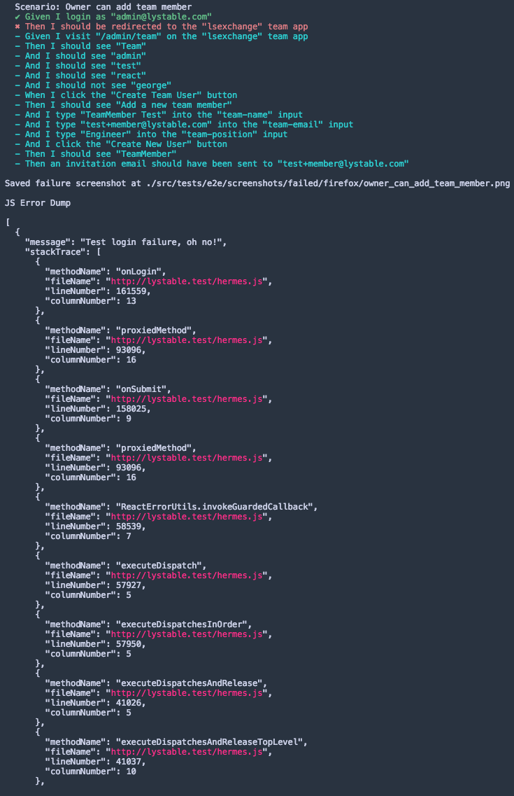
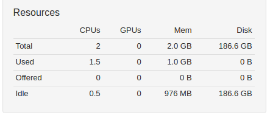
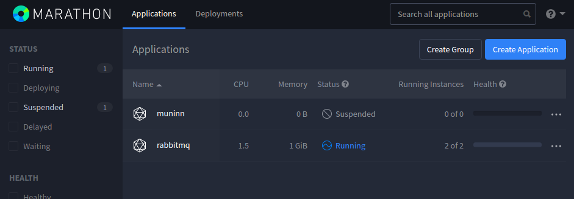

> This is a sprintly summary of upcoming, delivered and in-progress work for the **Infra DX Crew**.
> It'll contain technical musings, <SOMETHING ELSE> and probably a few memes.
>
> #### TLDR
>
> - we've placed our quarterly targets! (really really far away)
> - end-to-end failure debugging is given some love
> - some casual platform house-keeping: wiping of the [email history](https://github.com/lystable/lystable-frontend/pull/1874) feature
> - users need to brace themselves for our speedy app loading (in the works)
> - a sneak peek of the Platform-as-a-Service on .ink!

## On your mark, steady, go!

As Sprint 2 (of the blog history) begins, we've set our quarterly targets and the race begins!

We think we know our targets better than those guys:

| Domain | Metric        | Current           | Target  | %
| ---- | ------------- |:-------------:| -----:|
| Dev | **Time-to-production** | ~30 hours | 3 hours | **-90%**
| Dev | **CI feedback time (frontend)** | 50 minutes | 15 minutes | **-75%**
| Dev | **CI feedback time (backend)** | 15 minutes | 10 minutes | **-30%**
| User | **Time to load applications** | 5.7 seconds | 2.3 seconds | **-75%**
| User | **Time to initialise hera app** | 2 seconds | 0.5 seconds | **-75%**
| User | **Time to load fresh projects index** | 2.2 seconds | 0.6 seconds | **-75%**
| User | **Time to load fresh tasks index** | 2 seconds | 0.5 seconds | **-75%**
| User | **Time to load fresh invoices index** | 1.9 seconds | 0.5 seconds | **-75%**

I guess it helps to explain a couple of those.

**Time-to-production** is calculated from when a release is started (e.g. `dennis prepare` in our case) until the code is deployed and ready for customers to use. The metric we have taken is targeted at minor releases.

**CI feedback time** is the time it takes for the CI to confirm a change is good to merge. Keep in mind: the **failure** notification on Frontend is much better than that, since we don't wait for CircleCI to finish the build.

**Time to load applications** is the time until we can start fetching data to load an individual page... say whaaat?! We're shocked too, we've already got work you can follow below that will tackle this.

**Time to initialise / load** refers to data fetching from the API. As with everything, we're looking to SLASH this and give our users an experience they feel frictioness in and just love coming back to.

It's most certainly a quarter full of speeding up our product in every way, indicative of how much amazing work we've put into it so far.

### Will Q4 targets have to be full of speedups again?

You'll probably be thinking that the product is going to continue to grow, and we agree.

As for the dev domain OKRs, the core principle that will underlie the solutions will be to render our builds horizontally scalable, to the degree where we're not running into a risk of significant fluctuation in build times. This is also worth considering in line with the microservices architecture, which has one of the basic aims that we won't have to build and test all our software every time.

App loading and data fetching times will be [monitored closely](https://internal-event-monitoring.lystable.com) as we add new workflows and we'll, at least reactively but much quicker than before, be able to know that our users are going through a bad experience. It's been made [extremely easy](https://github.com/lystable/lystable-frontend/pull/1787) to push time metrics on new pages or different parts of the way as the page loads.

## What we worked on

### Quick wins for front-end builds (for users!)

Following some helpful advice from webpack maintainers we took a deeper dive. Some interesting finds! We're holding off on releasing this until we can see the impact on a more distributed bundle (ie. from code splitting).

Track here: https://github.com/lystable/lystable-frontend/pull/1866

### E2E JS Errors

Haven't you been yearning for these elusive console errors? 'Till now you had to run on local and log into the VNC session before you saw the console error. Thanks to this extra dump on the CI or at the end of your local run, that is no more :)

Read more: https://github.com/lystable/lystable-frontend/pull/1773

### Introduced prettier to front-end

Allowing us to focus on writing the code and not thinking about the style.

Read more here: https://github.com/lystable/lystable-frontend/pull/1683

Will be some follow up to improve the experience of partial adoption over coming sprints!

### Are we rebranding in the middle of this?

Are we? Oh yes, there's been a bit of [scoping](https://docs.google.com/document/d/1GWbkShkMMBHX0FQVOWlnBiIOs2jDLEBgBXe45nAhx6M/edit) going on... it's really as simple as

We put aside a 5-pointer ticket to wrap this Bash command up in a script, we should remember to start it with `!#/bin/bash` or just be explicit about the interpreter we want to use when running it `bash <script>`. So long as we get the acceptance criteria straight on the ticket we should be fine. We reckon we'll run this in production on the 22nd of May.

### PaaS (Platform-as-a-Service) sneak peek

The Platform-as-a-Service tool that we're setting up is motivated largely by the backend cohort's [microservices architecture movement](https://trello.com/c/l5oUlCku/54-the-move-to-microservices), while it has also been known as an eventuality as our platform and customer base grows.

What problem is it solving? Well, to put it simply, as the number of services in production continue to grow there's a few things that became unscalable:

- the adjusting of production capacity because a new feature
- the rollout of a new service
- the re-configuration of a service
- the moving of services from one failed VM to another

The PaaS gives us a single interface, UI and API, to manage creation, configuration, scaling and deploying of services. Not only that, it means we can have any VM size we prefer, and the scaling of services will be as fast as it is to deploy Docker containers, rather than VMs. :tada: :tada: :tada:

With the current production architecture the only way to scale the platform would be to hire more people, just to manage the moving around of services in production. Other options would be to give 1 service or 1 service stack per VM, and scale those individually. But that would also be 1) slow and, 2) a huge headache because we'd have to create our own conventions for creating a new service, an auto-scaling group in AWS, yada yada yada.

In comes [Mesosphere](https://mesosphere.com/)!

We've deployed it on staging with a [really basic configuration](https://lystable.atlassian.net/browse/INFRA-50) but you can see what [Mesos](https://internal-mesos-monitoring.lystable.ink/#/), which effectively acts like a distributed operating system, and [Marathon](https://internal-marathon-monitoring.lystable.ink/ui/#/apps), your service management interface are looking like.

It's still **very** much in the works and you can [track it here](https://lystable.atlassian.net/browse/INFRA-31). There'll be a :zap: talk on this stuff as we get some more parts of it out, no doubt :)

## What's up next?

- Code splitting (improving performance of loading applications for users and developers alike!)
- Data performance investigation (aimed at identifying the steps we need to take to reduce load times for data)
- Documentation strategy!
- Forms documented! (call to arms for review https://github.com/lystable/lystable-frontend/pull/1845)
- Writing up that rebrand.sh script
- Getting one of our Nameko workers to deploy through Marathon from CircleCI!

## Ending with a bombshell...

<i>*Not everyday is it sunny in sunny Barcelona!*</i>

